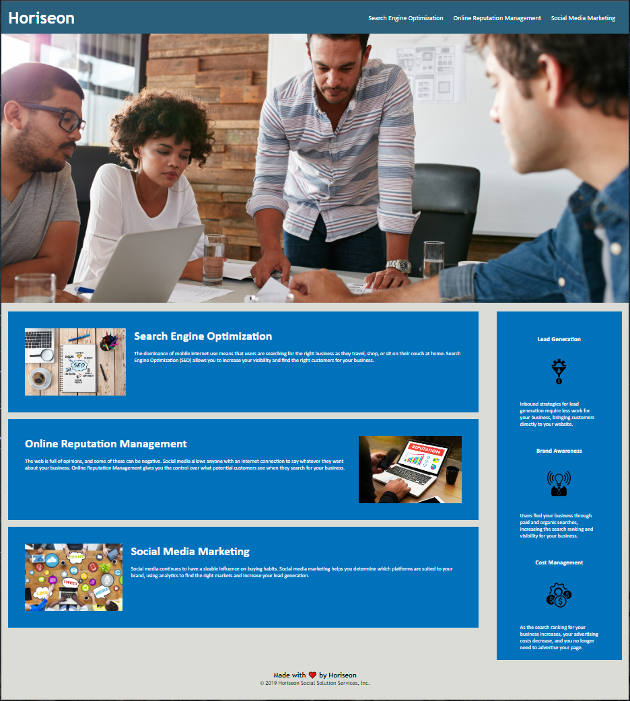

# Horiseon Social Solutions Inc Refactor

This was the first challenge assignment for our UPENN Bootcamp. We were tasked with taking the client's existing codebase and refactoring it to meet modern accessibility standards which would boost its SEO ranking. (See **User Story** and **Acceptable Criteria** sections below).

---

## 📕 User Story 

AS A marketing agency I WANT a codebase that follows accessibility standards SO THAT our own site is optimized for search engines

---

## ✔️ Acceptable Criteria 

- GIVEN a webpage meets accessibility standards
- WHEN I view the source code THEN I find semantic HTML elements
- WHEN I view the structure of the HTML elements THEN I find that the elements follow a logical structure independent of styling and positioning
- WHEN I view the icon and image elements THEN I find accessible alt attributes
- WHEN I view the heading attributes THEN they fall in sequential order
- WHEN I view the title element THEN I find a concise, descriptive title

---

## 🔧 Optimizations 

### HTML
- Replaced 
 elements with appropriate Semantic HTML elements.
- Changed colors on the page to provide a contrast that is in line with WCAG guidelines.
- Added descriptive alt text to relevant images for screen readers to function properly.
- Established a <main> section to highlight the most important information.
- Ensured heading attributes are in sequential order.
- Removed extra and unused classes and ids

### CSS
- Condensed redundant styling.
- Removed extra and unused selectors.

### Additional
- Commented both the HTML and CSS so future edits will be easier to execute.

---

## 📷 Screenshots 

---

## 🎯 Deployment

Website: https://alvinkp.github.io/Horiseon_Social_Solutions_Inc_Refactor/

Repository: https://github.com/alvinkp/Horiseon_Social_Solutions_Inc_Refactor

---

## ✉️ Authors 

- [@alvinkp](https://www.github.com/alvinkp)

